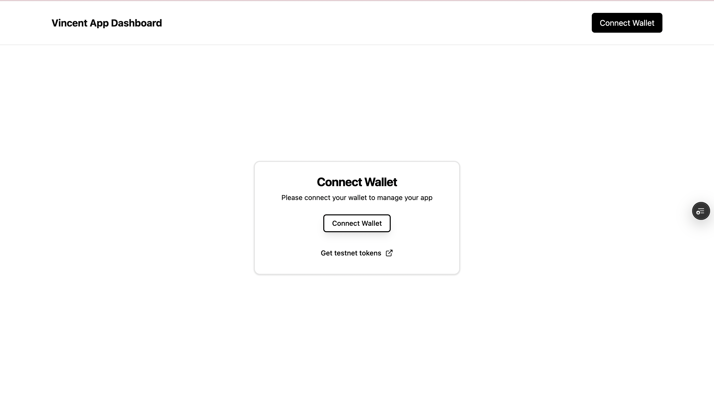

# Quick Start

Follow the below steps to register your Vincent App:

## 1. Selecting Tools & Policies
	- **Tools:** Vincent Tools are the operations that an Agent can perform on *behalf* of the user and are codified as Lit Actions. Lit Actions are immutable Javascript code snippets assigned to the Agent's wallet. As a Vincent App developer you prompt the user, via the Consent Page, to delegate the execution of these Tools for their Agent wallets thus allowing you to autonomously execute these pre-defined operations on behalf of your users.

	- **Policies:** Users can set guard-rails for the permitted Tools to dictate the operating conditions for that Tool. Tools can have multiple Policies like max daily spend or 2FA and all these policies should be met before the Tool can sign using the delegated user's Agent wallet. This also becomes important since your AI Agents can occasionally halucinate. Just like the Tools, Policies are also codified as Lit Action and you as a developer prompt the user a set of optional Policies for each Tool via the Consent Page.

	- **Policy Variables:** Each Policy can optionally have multiple Policy Vars. For example, max spend policy can have two vars: spend duration (hourly/daily/weekly) and max spend amount ($). These Policy Vars are fully configurable by the user.

	- **Selecting from existing Tool-Policy Registry:** We maintain a [repository](https://github.com/LIT-Protocol/Vincent/tree/wyatt/uniswap-tool-refactor/packages/vincent-tool-uniswap-swap) of common Tool & Policy Lit Actions which are readily available to all the Vincent Apps to help you get quickly off the ground. You can select any of these Tools & their Policies to register your Vincent App or write your own custom Tools. It's an ever expanding list and we're actively adding more Tools & Policies to the Registry.

	- **Writing your own Tools & Policies:** If none of the available Tool/Policies meet your needs you can write your own Lit Actions that signs using the user's delegated wallet.

## 2. Registering an App using the App Dashboard
	- **Management Wallet:** Once you've selected your Tools & Policies (IPFS Cids) head over to the App Dashboard where you need to connect your EOA wallet. This is your App management account which is used for adding Delegatees, registering Vincent Apps on-chain and publishing newer versions of your existing Vincent Apps.

	

	- **Create New App:** After you logged in and have selected the Tools & Policies you want to register your App with, you can create a new App by clicking on the "Create New App" button.

	

	- **Delegatees:** Delegatees are EOA wallets generated in the App Dashboard that are allowed to execute the permitted Tools on behalf of your users. You need to register these Delegatee addresses on-chain and the Tools check whether the executor matches the on-chain Delegatee registered for the App. You need to create a SessionSig using your Delegatee and provide it to execute the Tool Lit Action.

	

## 3. Using the Vincent SDK
	- **Handle User Login:** You can use the Vincent Consent Page to sign-in users to you App instead of implementing a separate User Login flow. You need to provide a redirectUri in the URLSearch params (`https://dashboard.heyvincent.ai/appId/160/consent?redirectUri=http://localhost:3000`) to receive the signed JWT from the user's Agent Wallet after they log in on the Vincent Consent Page. This can be used as the User's Auth for your App, for example, use it as the user's access token for your API requests.

	``` javascript
	import { VincentSDK } from '@lit-protocol/vincent-sdk';
	import { ethers } from 'ethers';

	const vincentSdk = new VincentSDK();
	const jwt = (await vincentSdk.getJWT()) || new URLSearchParams(window.location.search).get('jwt');

	await vincentSdk.storeJWT(jwt ?? '');
	const jwtVerifies = await vincentSdk.verifyJWT(window.location.origin);
	if (!jwt || !jwtVerifies) {
		return await vincentSdk.clearJWT(); // Clear any leftover and logout
	}

	const decodedJWT = await vincentSdk.decodeJWT();
	const userAgentWalletPublickey = decodedJWT.payload.pkpPublicKey as string;
	const userAgentWalletAddress = ethers.utils.computeAddress(userAgentWalletPublickey);
	```

	- **Execute Tools for User's Wallet:** You need to create SessionSigs using your Delegatee wallet and use it to call the `executeJs()` function for the permitted Tool. This is where you provide all your AI-Agentic logic in the jsParams of the `executeJs()`, for example, the tokens to buy and at what price. You can also query all the delegated users for your App using `getAllDelegatedUsers()`.

	```javascript
	import { ethers } from 'ethers';

	const delegateePrivateKey = DELEGATEE_PRIVATE_KEY_GENERATED_FROM_APP_DASHBOARD;
	const delegateeSigner = new ethers.Wallet(delegateePrivateKey, provider);
	const res = await invokeLitAction(delegateeSigner, toolIpfsCid, params); // This is the result of executing the Tool usually a txReceipt for the broadcasted tx
	```