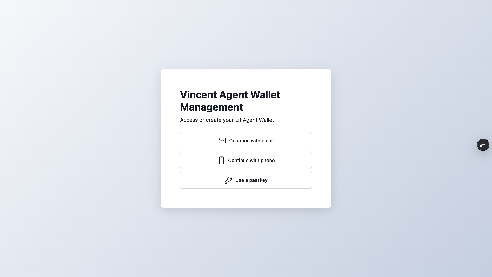

# Onboarding

When you visit an app that uses Vincent for Authentication you'll be directed to a Consent Page where you can review the permissions requested by the application and provide precisely scoped delegation to it. Follow the following steps to onboard to the Vincent ecosystem:

## 1. Create an Agent Wallet

The first time you visit an app that uses Vincent for Authentication & Delegation you'll be prompted to create an Agent Wallet with an Authmethod of your choice. Note, this wallet is a non-custodial wallet managed by the decentralized Lit Protocol network. It is **not** managed by the app you're visiting thus only you have access to it.

## 2. Review Permissions & Delegate

After you login you'll be required to review the permissions requested by the app on the Consent Page. On this page you can see the following details about the app:

    - **App:** The name and description of the app you're visiting.
    - **Account Address:** The EOA wallet address of the App owner.
    - **App Version:** The version of the app you're visiting. If the app publishes a new version you'll be prompted to update it.
    - **Tools:** Tools are the operations that an App can perform on *behalf* of your Agent Wallet and these are codified as Lit Actions. Lit Actions are **immutable** Javascript code snippets assigned to your Agent's wallet. Thus once you delegate it these Tools to an App the App owner cannot change the Tool's behavior making the delegation system trustless. You always have an option to revoke the App's delegation after which they won't be able to perform actions on your behalf.
    - **Policies:** Policies are the guard-rails for the permitted Tools to dictate the operating conditions for that Tool. Tools can have multiple Policies like max daily spend or 2FA and all these policies should be met before the Tool can sign using the delegated user's Agent wallet. You can configure the parameters of these Policies like specifying the max daily spend amount or the 2FA method. Just like the Tools, Policies are also codified as Lit Action.

## 3. Update App Version

Once you've approved an App and it publishes a new version, you'll be prompted to update to the latest version when you visit the App's Consent Page again. Note, it's not mandatory to update to the latest version unless the App disables an older version.

## 4. Redirect to the App

After you've logged in via the Consent Page you'll be redirected to the App page based on the `redirectUri` specified in the URLSearchParams: `https://dashboard.heyvincent.ai/appId/160/consent?redirectUri=http://localhost:3000`

